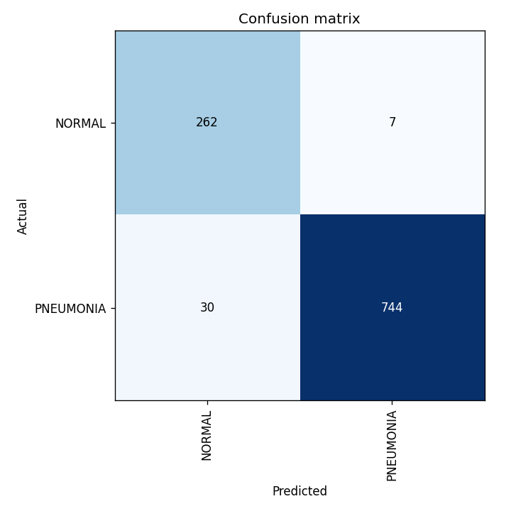
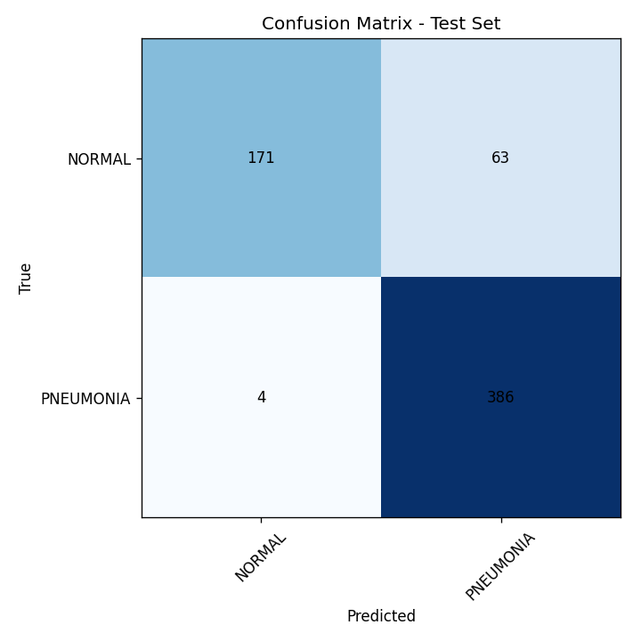

# 🫁 Pneumonia Disease Prediction

A deep learning project that uses chest X-ray images to classify Normal vs Pneumonia cases.
This repository contains:
- A training pipeline (with FastAI + ResNet50) to build and evaluate the model.
- A Streamlit web app for interactive predictions.

## ✨ Features

- Model Training with FastAI’s ResNet50 backbone.
- Evaluation Tools: confusion matrices and classification reports.
- Streamlit App: Upload or select X-ray samples for real-time predictions.
- Custom Thresholds & TTA: Adjust classification threshold and enable test-time augmentation.
- Visuals: Probability charts, confusion matrices, and sample previews.

## 📂 Project Structure

```
├── app.py                        # Streamlit app for predictions
├── train_model.py                # Training and evaluation pipeline
├── export.pkl                    # Saved trained model (generated after training)
├── confusion_matrix.png          # Validation confusion matrix
├── confusion_matrix_test.png     # Test set confusion matrix
├── requirements.txt              # Dependencies
```

## ⚙️ Installation

1. **Clone this Repository**
  ```bash
  git clone https://github.com/sushant2333/Pneumonia-Disease-Prediction.git
  cd Pneumonia-Disease-Prediction
  ```
2. **Create a virtual environment (recommended)**
   
   ```bash
   python -m venv .venv
   source .venv/bin/activate   # Linux/Mac
   .venv\Scripts\activate      # Windows
    ```
3. **Install dependencies**
   
   ```bash
   pip install -r requirements.txt
   ```
   
## 🏋️ Training

Make sure you have the Chest X-ray dataset (not included in repo).
Update the dataset path inside ```train_model.py``` if needed, then run:

```bash
python train_model.py
```

This will:

- Train a ResNet50 model.
- Generate validation and test confusion matrices.
- Save the trained model as ```export.pkl```.

## 🌐 Running the Web App

Once you have ```export.pkl``` (model weights), launch the app:

```bash
streamlit run app.py
```

Then open the local URL (usually ```http://localhost:8501```) in your browser.

Features:

- Upload a chest X-ray image (```.jpg```, ```.jpeg```, ```.png```).
- Or pick from test samples (if dataset path is available).
- View predicted class, probability distribution, and confusion matrices.

## 📊 Example Results

Validation Confusion Matrix:
<table>
  <tr>
    <td></td>
  </tr>
</table>
Test Confusion Matrix:
<table>
  <tr>
    <td></td>
  </tr>
</table>

## 🧠 Model & Framework

### ResNet50

This project uses ResNet50, a deep convolutional neural network with 50 layers, originally introduced by Microsoft Research.
Key characteristics:
- Residual Connections: ResNet solves the "vanishing gradient problem" by introducing skip connections (shortcuts) that allow gradients to flow through the network more easily.
- Depth with Stability: With 50 layers, ResNet50 can learn highly complex features while remaining trainable.
- Proven Performance: ResNet50 has been widely used in medical imaging tasks due to its strong ability to capture visual features such as textures, edges, and patterns.
For pneumonia detection, ResNet50 provides robust classification between Normal and Pneumonia chest X-rays by learning subtle differences in lung textures.

### FastAI

The project is built with the FastAI library on top of PyTorch.
FastAI provides:
- High-level APIs: Simplifies model creation, training, and evaluation with minimal code.
- Transfer Learning: Easily loads pretrained ResNet50 weights (trained on ImageNet) and fine-tunes them for medical imaging.
- DataBlocks API: Flexible pipeline for loading, augmenting, and normalizing chest X-ray images.
- Interpretability: Built-in tools such as confusion matrices and classification interpretation to evaluate model performance.
By combining ResNet50 and FastAI, this project leverages a state-of-the-art backbone with a user-friendly training and deployment workflow.

## 📌 Notes

- The dataset (images) is excluded from the repo due to size.
- ```.gitignore``` is configured to avoid pushing large image datasets.
- The trained model (```export.pkl```) is included here for convenience.

## ⚠️ Disclaimer

This project is for educational and research purposes only.
It is not intended for clinical or medical use.
